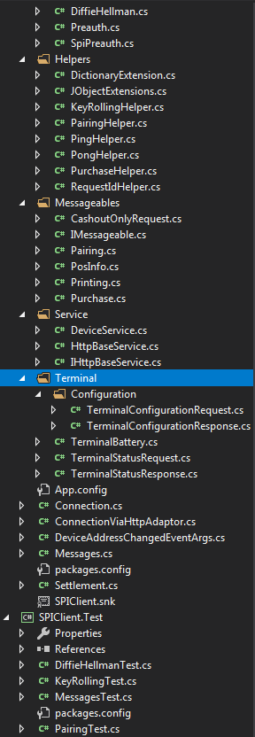

# Architectural Analysis

* Visual Studios 'code Analysis' tool gave 19 Warnings.
* Often too many classes in one file
*  Flat folder structure in solution
  * There are six classes ending with 'Helper'. Why are they not in their own folder  
  * Entities should be grouped together, not spread out over whole project. Suggest to 'bunde' the COM objects.
  * Attributes of third parties (newtonsoft) 'infect' the whole project. In a clean project I probably expect ONE class to parse third part formats.
  * Multiple threads are spawned for no reason. 3 locations.
  * Backing fields for event handlers are not required since 3.5 (?), they just bloat the code. Uninitialized eventhandlers will lead to system crash, no null pointer testing.
* **No Unit tests for the main class 'Connection'. **
* No use of dependency injection. Sometimes factories would make the code more readable.  Unit testing of DateTime related functions impossible. 
* No use of class inheritance or interfaces for bundlin common actions
* Unused message handlers which are always null and necessarily fail 
* What is the purpose of creating a thread for calling an event or setting a variable?
* Long running loops spawned in event handlers? Thats an architectural code stink!
* No modern asyny await approach 
* File names not containing class with this name 
* Violation of distribution of concerns: 'ToJson' adds a timestamp
* Inconsistent naming structure 'toMessage', 'ToMessage' (missing interfaces /abstract class inheritance  as mentioned above)
* Missing suppression flags create warnings (legacy support  )
* **SpiModel.addReceiptConfig violates plenty of coding principles... it doesnt even add to spimodel. **
* Deriving from EventArgs should lead to class named XyzEventArgs
* No layered approach

---
* It appears to me that there are way to many classes
* Checkout the extension functions
* Have a look at the Messages class how smooth it became

* Example folder structure

